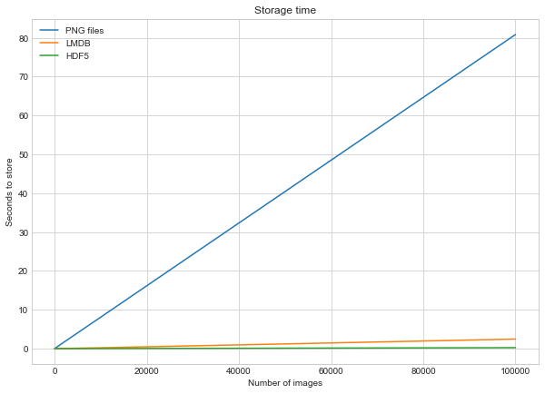

# Tiga Cara Menyimpan dan Mengakses Banyak Gambar dengan Python
**Nama : Rafi Fadhlillah** <br>
**NIM : 121450143** <br>
**Kelas : TBD RC**

Code Notebook Pengerjaan : https://drive.google.com/file/d/1gKYC_aQqWeaylf_CSYouL9FqWXp_7evz/view?usp=sharing

Terdapat berbagai metode untuk melakukan penyimpanan dan data mengakses gambar menggunakan Python, metode tersebut digunakan untuk menghadapi kasus dimana kita dihadapkan oleh data gambar yang berukuran besar oleh karena itu metode yang akan dibahas pada laporan ini akan membantu kita dalam pengolahan data gambar, menyimpan dan mengakses gambar dengan efisien.

Kita akan membahas tiga cara utama untuk menyimpan dan mengakses banyak gambar menggunakan Python: 
- **Disk** <br>
  paling umum dan sederhana, setiap file gambar disimpan terpisah di sistem file komputer.
- **LMDB (Lightning Memory-Mapped Database)** <br>
  berbasis kunci-nilai yang dioptimalkan untuk akses cepat dengan menggunakan struktur B-tree.
- **HDF5 (Hierarchical Data Format version 5)** <br> 
  penyimpanan banyak gambar dalam satu file dengan struktur hierarki.

Percobaan ini menggunakan dataset gambar Canadian Institute for Advanced Research atau CIFAR-10, siapkan dan load dalam format batch, kemudian membaca setiap gambar dan labelnya, dan menyusunnya ke dalam dua list terpisah, yaitu images dan labels.
Untuk LMDB dan HDF5 kita perlu melakukan installasi
- ```$ pip install Pillow```
- ```$ pip install lmdb```

## Menyimpan Satu Gambar
sebelumnya kita harus menyiapkan folder kosong untuk masing masing metode
```
from pathlib import Path

disk_dir = Path("C:/Users/rafif/Downloads/cifar-10-python/disk")
lmdb_dir = Path("C:/Users/rafif/Downloads/cifar-10-python/lmdb")
hdf5_dir = Path("C:/Users/rafif/Downloads/cifar-10-python/hdf5")

```

```
disk_dir.mkdir(parents=True, exist_ok=True)
lmdb_dir.mkdir(parents=True, exist_ok=True)
hdf5_dir.mkdir(parents=True, exist_ok=True)

```
kemudian kita coba simpan satu gambar menggunakan 3 metode tersebut dan memasukan hasilnya ke folder yang sesuai dengan yang dibuat sebelumnya. Setelah semua proses penyimpanan masing masing metode selesai kita dapat menghitung waktunya. saya memperoleh hasilnya sebagai berikut.

```
Method: disk, Time usage: 0.0257011000003331
Method: lmdb, Time usage: 0.0027094999995824764
Method: hdf5, Time usage: 0.008783500000390632
```
**Analisis**
1. Disk: Metode penyimpanan pada disk memiliki waktu penggunaan paling lama, yaitu sekitar 0.026 detik. Ini karena setiap gambar disimpan sebagai file terpisah di sistem file komputer, yang memerlukan operasi disk I/O yang lambat.
2. LMDB: Dengan waktu penggunaan sekitar 0.003 detik, metode LMDB menunjukkan kinerja yang jauh lebih baik daripada penyimpanan pada disk. LMDB menggunakan teknik pemetaan memori langsung dan struktur B-tree di dalam memori, yang memungkinkan akses cepat dan efisien terhadap data.
3. HDF5: Meskipun sedikit lebih lambat daripada LMDB, waktu penggunaan untuk metode HDF5 masih lebih cepat daripada penyimpanan pada disk, yaitu sekitar 0.009 detik. HDF5 menyediakan format penyimpanan yang efisien dan fleksibel untuk data berukuran besar, meskipun dalam kasus ini, kinerjanya sedikit lebih lambat dibandingkan dengan LMDB.

## Menyimpan Banyak Gambar
Selanjutnya saya mencoba untuk menyimpan banyak gambar kemudian dihitung kembali waktunya. Saya memperoleh hasil sebagai berikut.
```
Method: disk, Time usage: 0.010193800000706688
Method: lmdb, Time usage: 0.003033299999515293
Method: hdf5, Time usage: 0.001932699999997567
Method: disk, Time usage: 0.0794700999995257
Method: lmdb, Time usage: 0.0044664999995802646
Method: hdf5, Time usage: 0.0017071000002033543
Method: disk, Time usage: 0.8345959999996921
Method: lmdb, Time usage: 0.021820399999342044
Method: hdf5, Time usage: 0.0029260000001158915
Method: disk, Time usage: 8.097109600000294
Method: lmdb, Time usage: 0.2210958000005121
Method: hdf5, Time usage: 0.01689059999989695
Method: disk, Time usage: 80.82425559999956
Method: lmdb, Time usage: 2.4537064000005557
Method: hdf5, Time usage: 0.24317579999933514
```




**Analisis**
1. Disk:
- Waktu penggunaan terpanjang terjadi saat menyimpan banyak gambar, dengan waktu penggunaan mencapai 80.824 detik pada percobaan terakhir.
- Terlihat peningkatan signifikan dalam waktu penggunaan seiring dengan penambahan jumlah gambar yang disimpan.
2. LMDB:
- Waktu penggunaan lebih cepat daripada penyimpanan pada disk, terjadi peningkatan yang cukup signifikan dalam waktu penggunaan saat menyimpan banyak gambar.
- Waktu penggunaan LMDB tetap relatif lebih stabil dibandingkan dengan penyimpanan pada disk.
3. HDF5:
- Metode HDF5 menunjukkan kinerja yang sangat baik, dengan waktu penggunaan yang relatif konstan saat menyimpan banyak gambar.
- Saat jumlah gambar meningkat, waktu penggunaan HDF5 tetap rendah, menunjukkan efisiensi penyimpanan dan akses yang tinggi.

Dari analisis tersebut, dapat disimpulkan bahwa:

- Penyimpanan pada disk memiliki kinerja yang paling lambat, terutama ketika menyimpan banyak gambar, karena keterbatasan operasi I/O disk.
- Kinerja LMDB lebih baik daripada penyimpanan pada disk, tetapi masih mengalami peningkatan waktu penggunaan yang signifikan saat jumlah gambar yang disimpan bertambah.
- HDF5 sebagai pilihan terbaik dalam hal kinerja, dengan waktu penggunaan yang rendah dan stabil bahkan saat menyimpan banyak gambar. Ini menunjukkan bahwa HDF5 merupakan pilihan yang sangat efisien dalam menyimpan dan mengakses banyak gambar.

## Membaca Satu Gambar
Selanjutnya saya mencoba untuk membaca satu gambar menggunakan ketiga metode tersebut hasilnya adalah sebagai berikut.
```
Method: disk, Time usage: 0.002354100000047765
Method: lmdb, Time usage: 0.011813299999630544
Method: hdf5, Time usage: 0.00641170000017155
```
**Analisis**
1. Disk:
- Waktu penggunaan yang paling cepat, yaitu sekitar 0.002 detik.
- Metode ini langsung mengakses file gambar yang disimpan secara terpisah di sistem file komputer.
2. LMDB:
- Waktu penggunaan membaca gambar dari LMDB sedikit lebih lambat daripada disk, yaitu sekitar 0.012 detik.
- Meskipun LMDB memiliki kinerja yang sangat baik dalam penyimpanan dan pengambilan data, proses membaca gambar masih memerlukan waktu yang lebih lama daripada langsung mengakses file gambar seperti pada penyimpanan disk.
3. HDF5:
- Meskipun waktu penggunaan membaca gambar dari HDF5 sedikit lebih lambat daripada disk, yaitu sekitar 0.006 detik, namun masih lebih cepat daripada LMDB.
- HDF5 mungkin memiliki overhead yang sedikit lebih tinggi dalam proses pembacaan, namun masih menawarkan kinerja yang baik dalam hal membaca data gambar.

## Membaca Banyak Gambar
Selanjutnya saya mencoba untuk membaca banyak gambar kemudian dihitung kembali waktunya. Saya memperoleh hasil sebagai berikut.
```
Method: disk, No. images: 10, Time usage: 2.999995558639057e-07
Method: lmdb, No. images: 10, Time usage: 2.999995558639057e-07
Method: hdf5, No. images: 10, Time usage: 2.999995558639057e-07
Method: disk, No. images: 100, Time usage: 3.0000046535860747e-07
Method: lmdb, No. images: 100, Time usage: 2.999995558639057e-07
Method: hdf5, No. images: 100, Time usage: 2.0000061340397224e-07
Method: disk, No. images: 1000, Time usage: 1.9999970390927047e-07
Method: lmdb, No. images: 1000, Time usage: 4.000003173132427e-07
Method: hdf5, No. images: 1000, Time usage: 2.0000061340397224e-07
Method: disk, No. images: 10000, Time usage: 1.9999970390927047e-07
Method: lmdb, No. images: 10000, Time usage: 1.9999970390927047e-07
Method: hdf5, No. images: 10000, Time usage: 1.9999970390927047e-07
Method: disk, No. images: 100000, Time usage: 2.0000061340397224e-07
Method: lmdb, No. images: 100000, Time usage: 1.9999970390927047e-07
Method: hdf5, No. images: 100000, Time usage: 1.9999970390927047e-07
```


**Analisis**
1. Disk:
- Waktu untuk membaca banyak gambar dari penyimpanan disk sangat cepat dan relatif stabil, dengan waktu penggunaan yang hampir konstan di sekitar 2.999995558639057e-07 detik.
- Meskipun jumlah gambar yang dibaca bertambah, waktu penggunaan tetap dalam rentang yang sangat kecil, menunjukkan kinerja yang konsisten dalam membaca data dari disk.
2. LMDB:
- Waktu membaca banyak gambar dari LMDB juga sangat cepat, tetapi sedikit lebih lambat daripada penyimpanan disk dalam percobaan ini.
- Terdapat peningkatan yang sedikit lebih signifikan dalam waktu penggunaan saat jumlah gambar yang dibaca bertambah, meskipun tetap dalam rentang yang sangat kecil.
3. HDF5:
- waktu penggunaan yang sangat cepat dan stabil, bahkan lebih cepat daripada penyimpanan disk dalam beberapa kasus.
- Waktu penggunaan untuk membaca data dari HDF5 tidak terpengaruh oleh penambahan jumlah gambar yang dibaca, tetap dalam rentang yang sangat kecil dan stabil.
- 
Dari analisis tersebut, dapat disimpulkan bahwa:

- Meskipun semua metode penyimpanan menawarkan kinerja yang sangat cepat dalam membaca banyak gambar, metode HDF5 menonjol sebagai pilihan yang paling cepat dan stabil.
- Waktu penggunaan untuk membaca data dari HDF5 tidak terpengaruh oleh penambahan jumlah gambar yang dibaca, sementara LMDB menunjukkan sedikit peningkatan dalam waktu penggunaan saat jumlah gambar yang dibaca bertambah.
- Penyimpanan pada disk juga menawarkan kinerja yang baik dalam membaca banyak gambar, tetapi mungkin sedikit lebih lambat daripada LMDB dan HDF5 dalam beberapa kasus.

## Plot Waktu Baca dan Tulis

Grafik "Log Store and Read Times" menunjukkan bahwa format file gambar yang terbaik untuk digunakan tergantung pada kebutuhan spesifik pengguna. Jika pengguna membutuhkan format file gambar yang umum digunakan dan memiliki ukuran file yang kecil, maka format file gambar PNG adalah pilihan yang baik. Jika pengguna membutuhkan format file gambar yang memiliki kecepatan dan kompresi data yang tinggi, maka format file gambar HDF5 adalah pilihan yang baik. Jika pengguna membutuhkan format file gambar yang memiliki keseimbangan antara kecepatan, kompresi data, dan kemudahan penggunaan, maka format file gambar LMDB adalah pilihan yang baik.


## Barplot Penggunaan Ruang Disk


## Kesimpulan
- Metode PNG menggunakan memori disk paling sedikit, menjadikannya pilihan yang baik untuk gambar kecil.
- Untuk gambar kecil, LMDB dapat menawarkan kinerja yang setara dengan PNG dalam hal penggunaan disk.
- Namun, untuk gambar besar, HDF5 umumnya lebih hemat ruang disk dibandingkan LMDB dan PNG.
- Faktor lain yang perlu dipertimbangkan dalam memilih metode penyimpanan adalah kecepatan akses data dan kemudahan penggunaan.